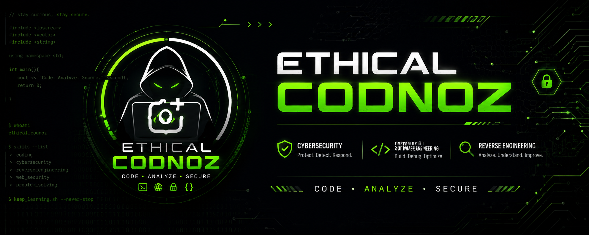

# ⚡ Codnoz (@ethicalcodnoz)

<div align="center">
  
</div>
<br>
<div align="center">
  
</div>

<p align="center">
  <i>17yo | Coder | Hacker</i>
</p>

<p align="center">
  <a href="https://t.me/codnoz" target="_blank">
    
  </a>
  <a href="https://instagram.com/ethicalcodnoz" target="_blank">
    
  </a>
</p>

---

```console
codnoz@matrix:~$ whoami
ethicalcodnoz
codnoz@matrix:~$ cat /etc/passwd | grep codnoz
codnoz:x:0:0:17yo Security Researcher:/root:/bin/bash
codnoz@matrix:~$ ./deploy_payload.sh
[+] Establishing reverse shell... Connected.
```

## 👨‍💻 About Me

17yo developer & security researcher. I spend my time reversing binaries, writing low-level code, and breaking systems. Mostly coding in C/C++, Rust, and Python. If it runs, it can be bypassed.

- 🔭 **Current focus:** Windows Internals, game hacking (anti-cheat evasion), and exploit dev.
- 💻 **Dev style:** Bare metal, zero overhead. 
- 🦇 **Vibe:** Always learning, always breaking things.

---

## 🛠️ Stack & Tools

### 🔴 Core
<p align="left">
  <a href="https://skillicons.dev">
    
  </a>
</p>

### 💀 Offensive & RE
> `x64/x86 Assembly` | `ARM64` | `IDA Pro` | `Ghidra` | `WinDbg` | `x64dbg` | `Exploit Dev` | `Malware Analysis` 

---

## 📊 Stats

<div align="center">
  
  
</div>

---

<p align="center">
  
</p>
